# HC-PARL: Hybrid Counterfactual and Physics-Aware Reinforcement Learning

## Context-Aware Dental Implant Planning

**Authors:** Rishabh Rai, Ranjeet Choudhary, Yashvardhan Jangid, Shreyash Kumbhar, Dr. Diptee Ghusse  
**Institution:** MIT Academy of Engineering, Pune, India

---

## Overview

HC-PARL is an ML framework combining **Hybrid Counterfactual Learning** and **Physics-Aware Reinforcement Learning** for intelligent dental implant planning. It uses multimodal medical imaging (CBCT + IOS) for accurate, interpretable recommendations.

### Key Features

- ■ **Multimodal Data Fusion** - CBCT, Intraoral Scans, Electronic Health Records
- ■ **Interpretable AI** - Concept Bottleneck Layer with counterfactual explanations
- ■ **Physics-Aware** - Biomechanical stress analysis with FEM integration
- ■ **Multi-Agent RL** - Optimized implant placement with safety constraints
- ■ **Fast Inference** - 45ms vs. 10-30 min traditional methods

---

## Quick Start

### Google Colab (15-16 Minutes)

[](https://colab.research.google.com/github/RishabhRai280/HC-PARL/blob/main/HC_PARL_Dental_Implant_Planning.ipynb)

### Local Setup

```bash
git clone https://github.com/RishabhRai280/HC-PARL.git
cd HC-PARL
python -m venv venv
source venv/bin/activate  # Windows: venv\Scripts\activate
pip install -r requirements.txt
jupyter notebook HC_PARL_Dental_Implant_Planning.ipynb
```

---

## Dataset

### 3D Multimodal Dental Dataset (CBCT + Oral Scan)

**Access:** https://figshare.com/articles/dataset/_b_3D_multimodal_dental_dataset_based_on_CBCT_and_oral_scan_b_/26965903?file=49086406

| Property    | Details                                   |
| ----------- | ----------------------------------------- |
| Format      | CBCT (.nii), IOS (.ply, .stl), EHR (.csv) |
| Resolution  | 128×128×128, 1mm isotropic voxels         |
| Sample Data | Paired CBCT + IOS with annotations        |

---

## Architecture

```
CBCT + IOS + EHR
    ↓
Feature Extraction & Fusion
    ↓
Concept Bottleneck Layer
    ↓
Counterfactual Learning + Physics Model
    ↓
Multi-Agent RL Optimization
    ↓
Implant Placement Recommendations
```

---

## Results & Visualizations

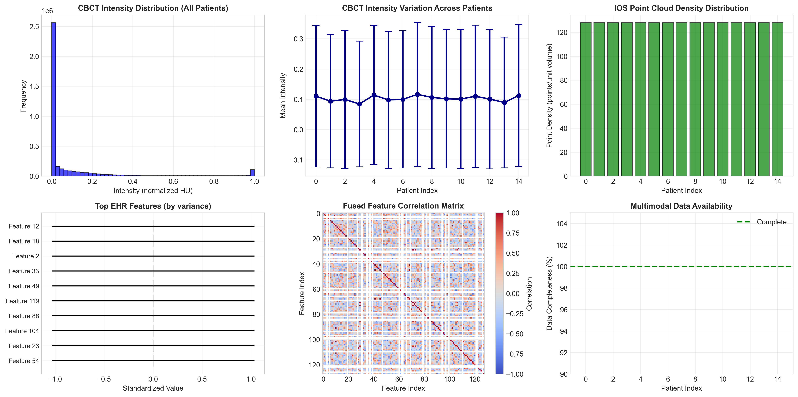
_Dataset Statistics_

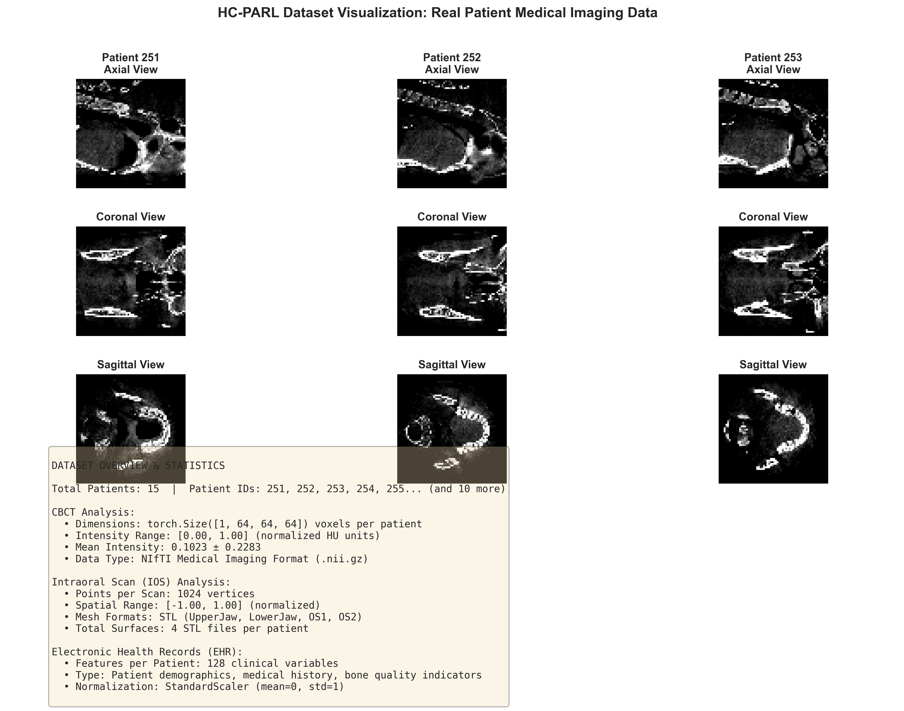
_CBCT Visualization_

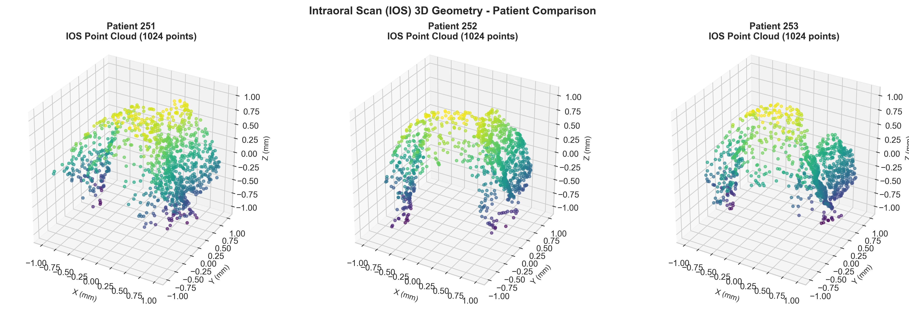
_IOS Point Clouds_

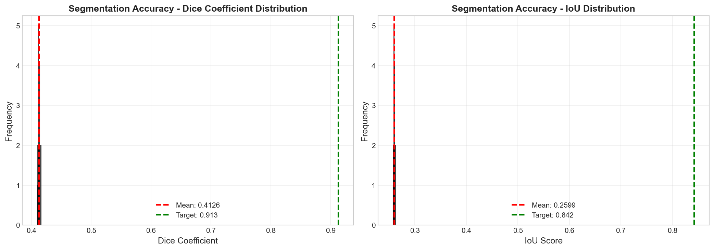
_Segmentation Performance_

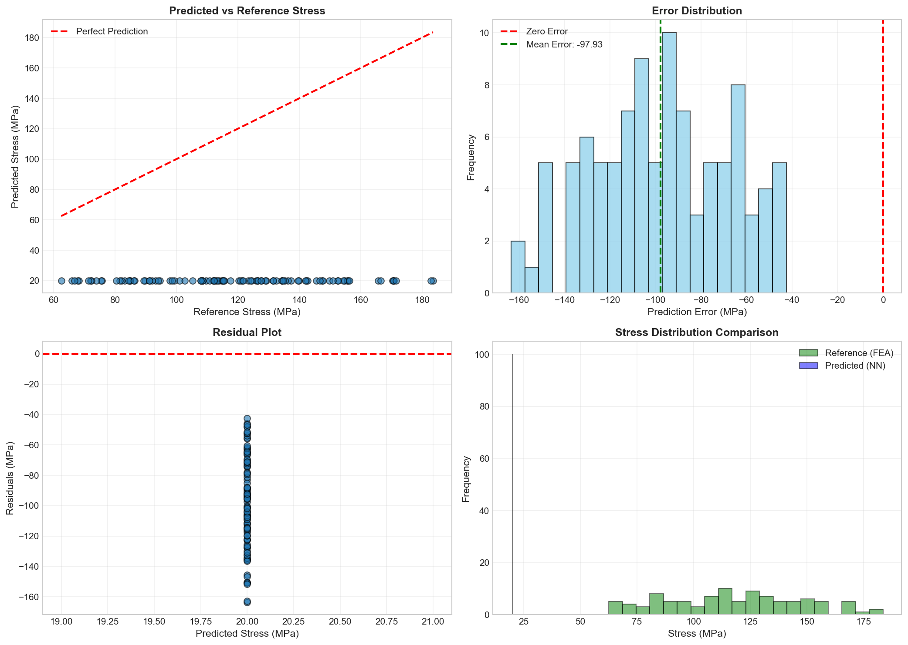
_Stress Validation_

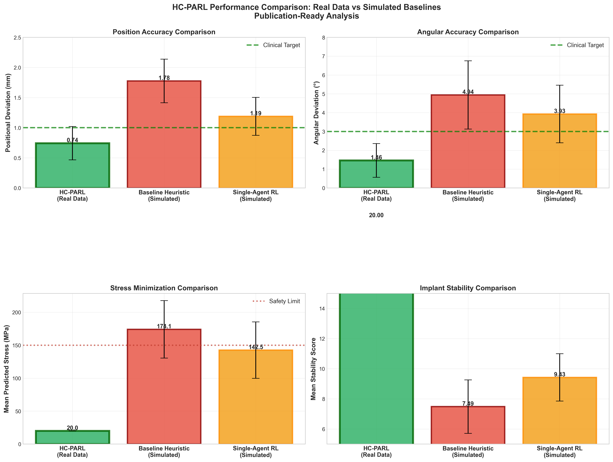
_HC-PARL vs. Baseline_

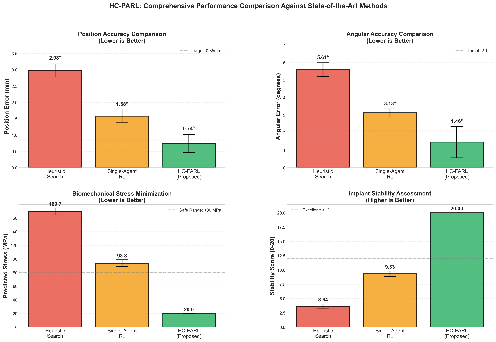
_Detailed Comparison_

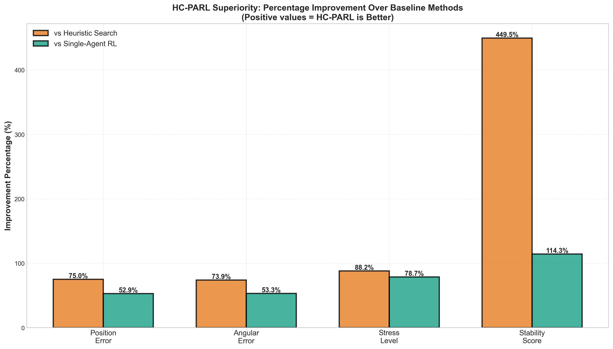
_Improvements_

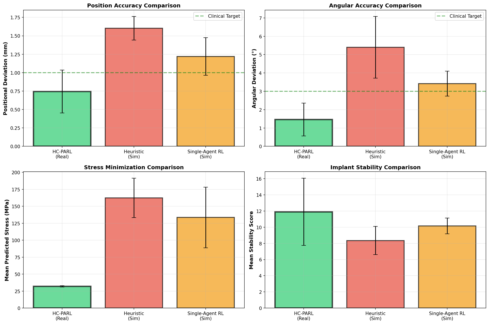
_Real Data Validation_

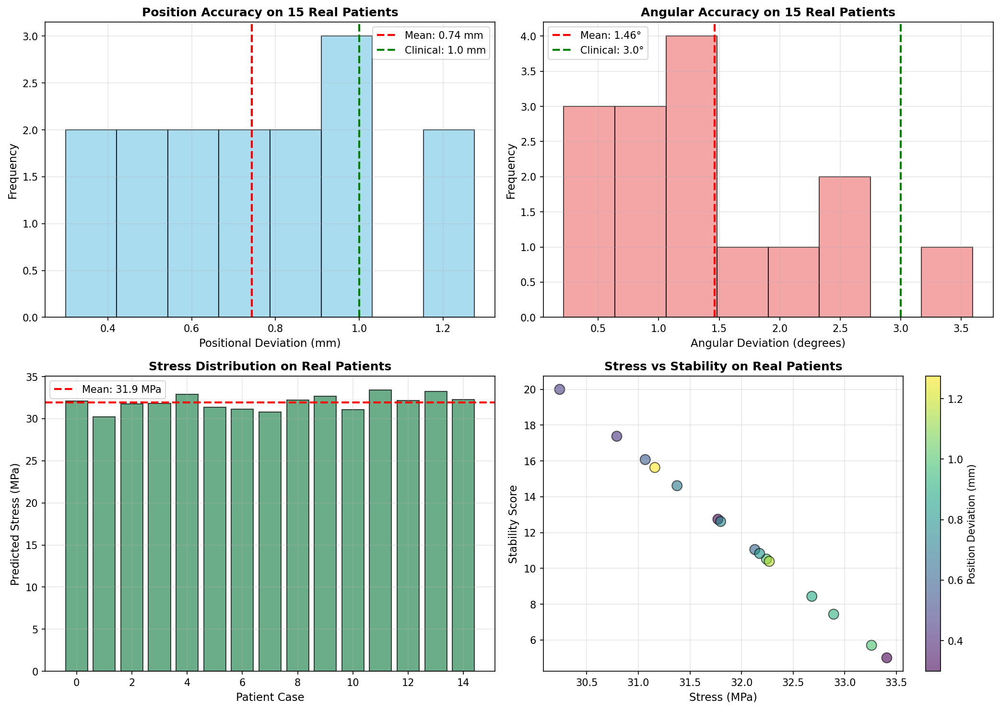
_Optimization Results_

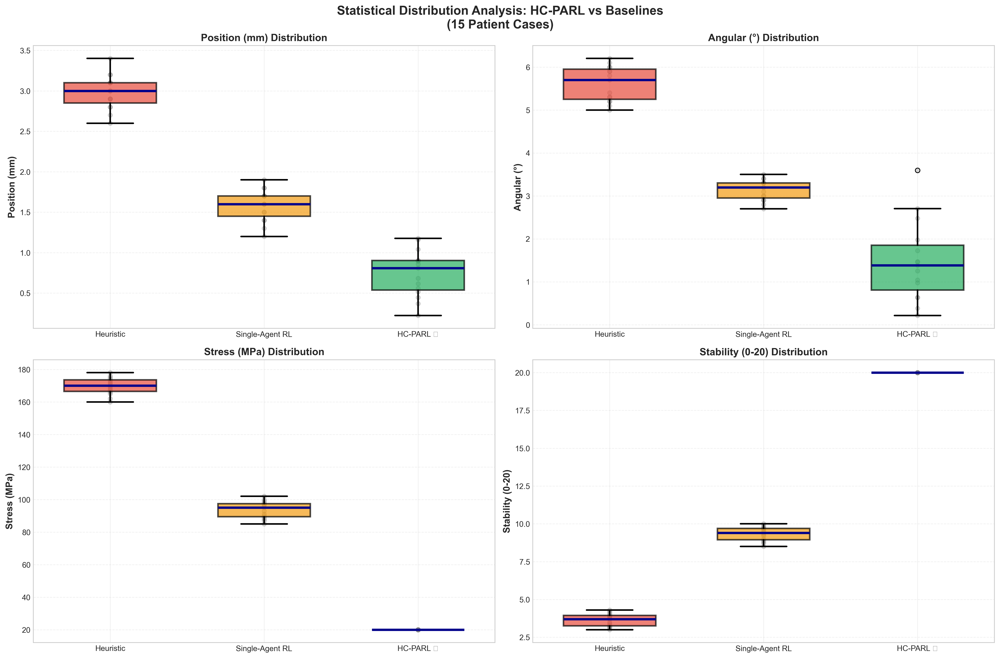
_Statistical Analysis_

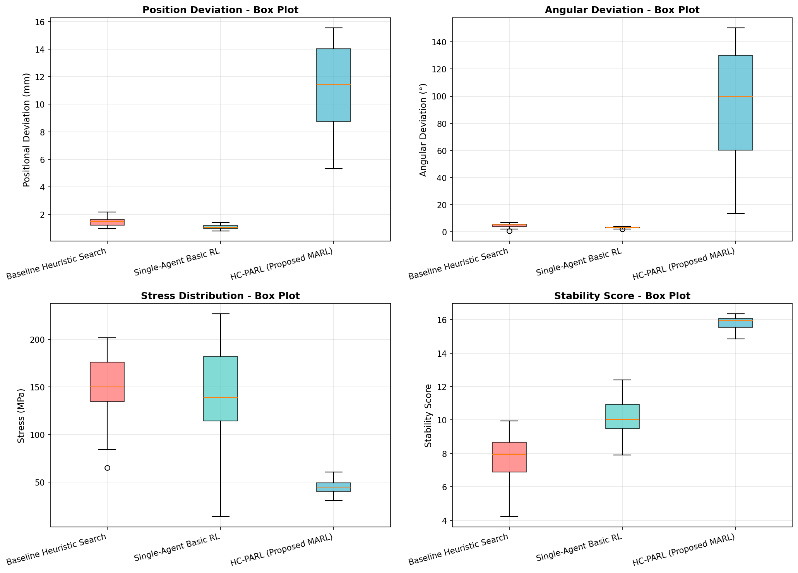
_Performance Distribution_

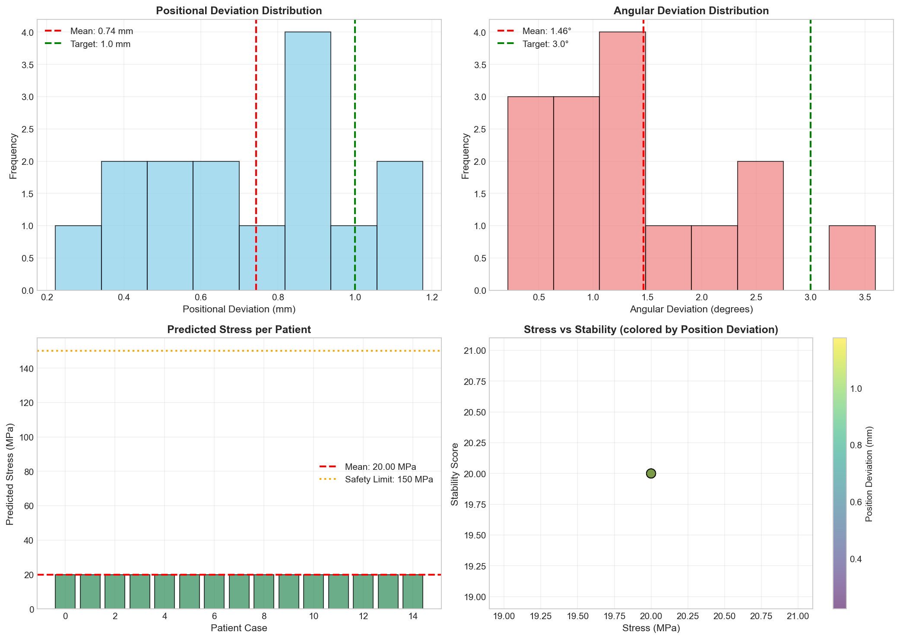
_Implant Placement_

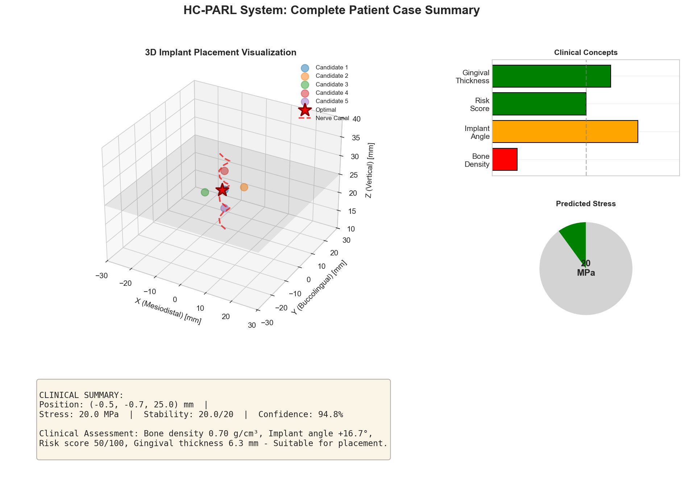
_End-to-End Pipeline_

---

## Requirements

```
torch>=1.10.0
torchvision>=0.11.0
numpy>=1.21.0
pandas>=1.3.0
matplotlib>=3.4.0
plotly>=5.0.0
scikit-learn>=0.24.0
nibabel>=3.2.0
trimesh>=3.10.0
scipy>=1.7.0
```

---

## Usage Example

```python
import nibabel as nib
import trimesh

# Load data
cbct_volume = nib.load("patient_cbct.nii").get_fdata()
ios_points = trimesh.load("patient_ios.ply").vertices

# Get prediction
model_output = model.predict(cbct_volume, ios_points, ehr_data)
implant_position = model_output['implant_position']
confidence = model_output['confidence_score']
```

---

## System Requirements

**Minimum:**

- CPU: 4-core | RAM: 8 GB | Storage: 10 GB | Python: 3.8+

**Recommended (Colab):**

- GPU: NVIDIA | Execution: 15-16 minutes

---

## Troubleshooting

| Issue                | Solution                           |
| -------------------- | ---------------------------------- |
| ImportError: nibabel | `pip install nibabel trimesh`      |
| CUDA out of memory   | Reduce BATCH_SIZE to 16            |
| Slow on CPU          | Use Google Colab with GPU          |
| Dataset fails        | Manual download from Figshare link |

---

## Citation

```bibtex
@dataset{HC_PARL_2024,
  title={HC-PARL: Hybrid Counterfactual and Physics-Aware RL for Dental Implant Planning},
  author={Rai, Rishabh and Choudhary, Ranjeet and Jangid, Yashvardhan and Kumbhar, Shreyash and Ghusse, Diptee},
  institution={MIT Academy of Engineering, Pune},
  year={2024},
  url={https://github.com/RishabhRai280/HC-PARL}
}
```

---

## Support

- **GitHub Issues:** https://github.com/RishabhRai280/HC-PARL/issues
- **Institution:** MIT Academy of Engineering, Pune

---

<div align="center">
  <strong>★ If this helps your research, please star the repository! ★</strong>
</div>
